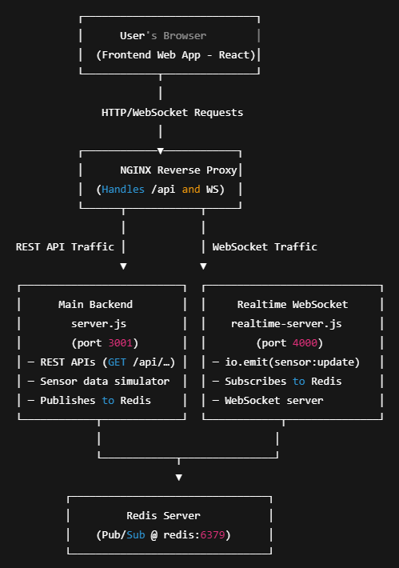

A real-time backend system for simulating and streaming IoT sensor data using Node.js, Express, Redis Pub/Sub, and Socket.IO.
It includes RESTful APIs to fetch the latest data and WebSocket support for live updates.
NGINX acts as a reverse proxy to route frontend, API, and WebSocket traffic.

### Run project ###

```bash
docker compose up --build
```

### System Architect ###



Frontend: React + Chart.js + Socket.IO client
Backend REST (server.js): Express.js, providing static data (latest sensor data via REST API)
Backend Realtime (realtime-server.js): Express + Socket.IO server + Redis Pub/Sub
Redis: used as intermediate storage (Pub/Sub + cache)
Nginx: Reverse proxy and load balancing
Docker Compose: Orchestrating containers
